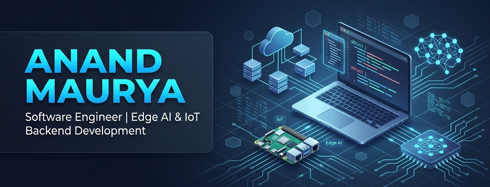

  

# Hi, I'm Anand Kumar Maurya 👋

AI-focused IoT, Edge AI, and Backend Engineer building intelligent systems across hardware, backend platforms, local AI, and self-hosted infrastructure.

I work with Java, Spring Boot, Linux, Docker, MQTT, Proxmox, edge devices, and local LLMs to build practical engineering solutions for industrial automation, IoT platforms, backend microservices, AI-assisted infrastructure, and real-world device communication systems.

---

## About me

I’m a IoT engineer with 4+ years of experience across backend development, IoT systems, industrial automation, DevOps, and embedded Linux. My work often sits at the intersection of hardware, backend services, edge devices, and AI-powered automation.

I have worked on systems such as gate automation, real-time container tracking using DGPS, weighbridge automation, warehouse automation, document digitalization using OCR, device tracking platforms, custom role-based access control systems, notification services, and payment gateway integrations.

I’m currently focused on Edge AI, Agentic AI, Spring AI, MCP servers, local LLMs, self-hosted infrastructure, and intelligent IoT/backend platforms. I enjoy building systems that are reliable, secure, observable, and practical enough to run in real-world environments.

My personal homelab includes Raspberry Pi, Radxa Rockchip NPU devices, Proxmox-based SBC clusters, TrueNAS, OpenWrt, and a Mac mini for local LLM workloads.

## Core strengths

- Java and Spring Boot backend development.
- IoT and embedded systems integration.
- Linux administration and shell scripting.
- Docker, Proxmox, and self-hosted infrastructure.
- Edge AI and local model deployment.
- Automation, monitoring, and system reliability.

## Tech stack

### Languages

### Backend & DevOps

### AI & Data

### Embedded & IoT
Arduino • Raspberry Pi • STM32 • Luckfox Pico • Radxa

## Current focus

- Edge AI model deployment and optimization.
- Speech AI and local inference systems.
- Linux-based infrastructure and automation.
- Self-hosted services and homelab setups.
- Embedded systems and IoT development.
- Scalable backend applications using Spring Boot.

## Links

- Portfolio: [anandmaurya.in](https://anandmaurya.in)
- Blog: [anandmaurya.in/blog](https://anandmaurya.in/blog)
- GitHub: [anand34577](https://github.com/anand34577)
- Medium: [medium.com/@anand34577](https://medium.com/@anand34577)

---

### Building efficient systems from edge to cloud

